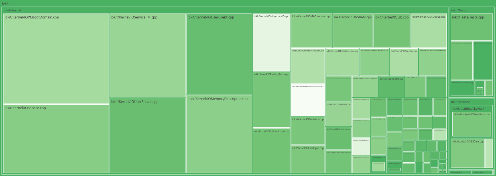

cyclo
=====

* computes the cyclomatic complexity given a file or directory of files and
visualizes it
* useful for estimating the code complexity of files at a glance
* supports C and C++ file parsing (for now)
* plotly.js is used for the treemap visualization in browser



treemap
-------

The size of the box corresponds to the number of lines of code, and the hotness of
the color corresponds to the mean function cyclomatic complexity.

The colorscheme can be changed by editing the `colorscale` value in the `cyclo.js`
file in the `html/scripts` directory. Valid choices are mentioned in the
[Plotly documentation](https://plotly.com/javascript/reference/treemap/#treemap-marker-colorscale)

caveats
-------

The way the mean function cyclomatic is measured is very hacky. It searches for certain keywords when determing decision statements (if, for, while, etc), logical operations (AND, OR), and function definitions. For C/C++ especially, since the function counter actually counts the number of `return` expressions which is pretty bad but there aren't really any other options; AST generation was an absolute pain in C/C++ because of preprocessor defines. The cyclomatic complexity is decently accurate but definitely should be taken with a grain of salt.

usage
-----

```sh
# build both binaries
cd cyclo
cargo build

# compute the complexities for the files in some directory
cargo run --bin cyclo -- --path /path/to/files

# then run the webserver to view it
cargo run --bin webserver -- --port 3030
```

to do
-----

* js and py support
